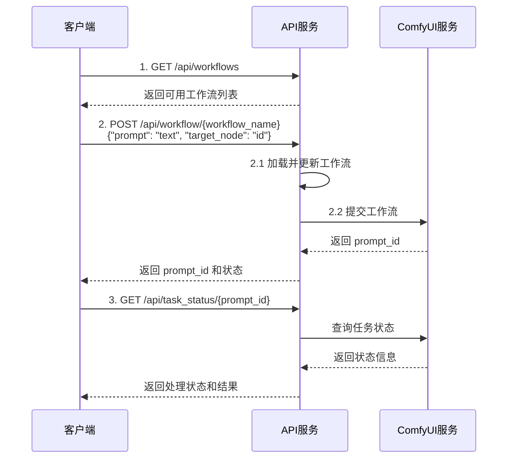
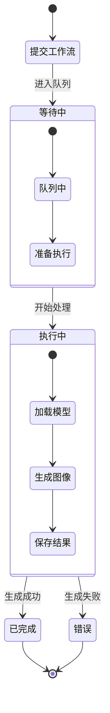
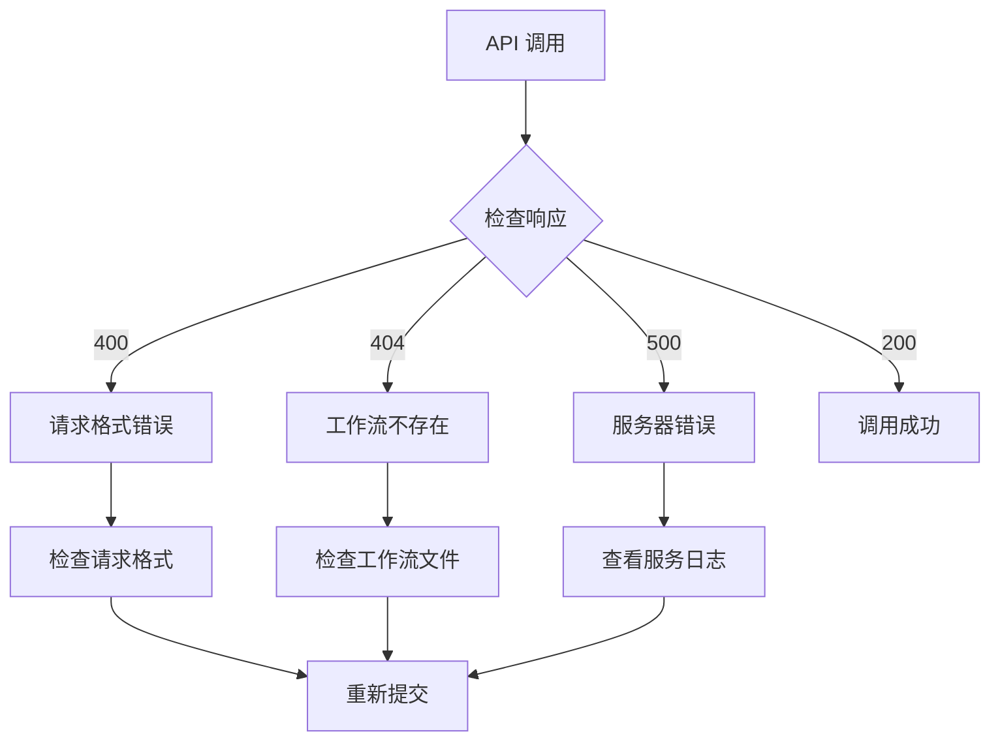

# ComfyUI API Service

基于Flask的ComfyUI API服务，用于远程图像生成和工作流管理。

## 功能特性

- 支持配置ComfyUI服务地址
- 提供工作流提交接口
- 支持查询历史记录
- 支持查询系统状态
- 支持查看队列状态
- 支持测试连接
- 支持工作流管理
- 支持任务状态查询
- 支持历史记录查询
- 支持图片获取

## 安装

1. 安装依赖：
```bash
pip install -r requirements.txt
```

2. 配置环境变量（创建.env文件）：
```env
COMFYUI_BASE_URL=http://localhost:8188
FLASK_DEBUG=True
FLASK_HOST=0.0.0.0
FLASK_PORT=5000
```

## API 端点

### 1. 测试连接

测试ComfyUI服务器连接状态。

```http
GET /api/test_comfy
```

响应示例：
```json
{
    "status": "success",
    "comfyui_url": "http://localhost:8188/system_stats",
    "response": {
        "system_stats": { ... }
    }
}
```

### 2. 工作流管理

#### 列出所有工作流
```http
GET /api/workflows
```

响应示例：
```json
{
    "workflows": ["sd_txt2img", "sd_img2img", "flux_test"]
}
```

#### 运行工作流

提供两种请求格式：

1. 简单格式（推荐）：直接指定提示语和目标节点
```http
POST /api/workflow/<workflow_name>
Content-Type: application/json

{
    "prompt": "your prompt text",
    "target_node": "41"  // 可选，不指定时会自动查找第一个文本输入节点
}
```

2. 高级格式：直接更新节点参数
```http
POST /api/workflow/<workflow_name>
Content-Type: application/json

{
    "1": {
        "inputs": {
            "text": "a beautiful mountain landscape"
        }
    }
}
```

响应示例：
```json
{
    "status": "success",
    "prompt_id": "c74f73fc-fb01-4b3c-81a5-cab506c43e27",
    "node_errors": {},
    "error": null,
    "client_id": "my-api-1732866007"
}
```

错误响应示例：
```json
{
    "error": "Target node 41 is not a text input node"
}
```

或
```json
{
    "error": "No suitable text input node found in workflow"
}
```

注意事项：
1. 简单格式（推荐）：
   - `prompt`: 要传入的提示语文本
   - `target_node`: 可选，目标节点ID。如果指定，必须是工作流中存在的文本输入节点（支持 Text Multiline 或 CLIPTextEncode 类型）
   - 如果不指定 target_node，API 会自动查找工作流中第一个合适的文本输入节点

2. 高级格式：
   - 直接指定要更新的节点ID和其输入参数
   - 需要了解工作流的具体结构
   - 可以同时更新多个节点的多个参数

调试信息：
- API 会在服务器终端打印完整的工作流 JSON 和发送给 ComfyUI 的请求内容
- 格式化的日志包括：
  1. 最终的工作流 JSON（=== Final Workflow JSON ===）
  2. 发送给 ComfyUI 的完整请求（=== Request to ComfyUI ===）

### 3. 任务状态查询

#### 查询任务状态
```http
GET /api/task_status/<prompt_id>
```

可能的响应状态：

1. 等待中：
```json
{
    "status": "pending",
    "message": "Task is waiting in queue",
    "queue_position": 1
}
```

2. 执行中：
```json
{
    "status": "running",
    "message": "Task is currently running",
    "execution_info": { ... }
}
```

3. 已完成：
```json
{
    "status": "completed",
    "message": "Image generation completed",
    "images": [
        {
            "url": "http://localhost:8188/view?filename=xxx.png",
            "filename": "xxx.png",
            "subfolder": "",
            "type": "temp"
        }
    ],
    "execution_time": 10.5,
    "node_errors": {}
}
```

4. 其他状态：
- `processing`: 处理中但未生成图片
- `not_found`: 未找到任务
- `unknown`: 状态未知
- `error`: 发生错误

### 4. 历史记录

#### 获取所有历史记录
```http
GET /api/history
```

#### 获取特定任务历史
```http
GET /api/history/<prompt_id>
```

### 5. 图片获取

获取生成的图片信息：
```http
GET /api/image/<prompt_id>
```

响应示例：
```json
{
    "status": "success",
    "images": [
        {
            "url": "http://localhost:8188/view?filename=ComfyUI_00001_.png",
            "filename": "ComfyUI_00001_.png",
            "subfolder": "",
            "type": "temp"
        }
    ]
}
```

## 工作流参数说明

工作流JSON格式：
```json
{
    "1": {
        "inputs": {
            "text": "提示词"
        }
    },
    "3": {
        "inputs": {
            "seed": 42,
            "steps": 20,
            "cfg": 7.5,
            "sampler_name": "euler_ancestral",
            "scheduler": "normal",
            "denoise": 1.0
        }
    }
}
```

## 错误处理

所有API错误响应格式：
```json
{
    "error": "错误描述",
    "status_code": 400
}
```

## 开发说明

1. 工作流文件存放在 `workflows` 目录
2. 支持动态参数更新
3. 提供详细的错误信息和日志
4. 支持异步任务状态查询

## 注意事项

1. 图片URL中的 `type=temp` 表示临时文件，会定期清理
2. 建议定期查询任务状态直到完成
3. 确保ComfyUI服务器地址配置正确

## 调用流程指引

### 基本工作流程



### 详细状态流转



### 推荐使用流程

1. **准备阶段**
   ```mermaid
   flowchart LR
       A[准备工作流文件] --> B[上传到 workflows 目录]
       B --> C[确认文本输入节点 ID]
   ```

2. **调用阶段**
   ```mermaid
   flowchart LR
       A[获取工作流列表] --> B[提交生成请求]
       B --> C[轮询任务状态]
       C --> D{状态检查}
       D -->|完成| E[获取结果]
       D -->|进行中| C
       D -->|错误| F[错误处理]
   ```

### 错误处理流程



## 运行

```bash
python app.py
